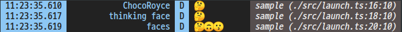
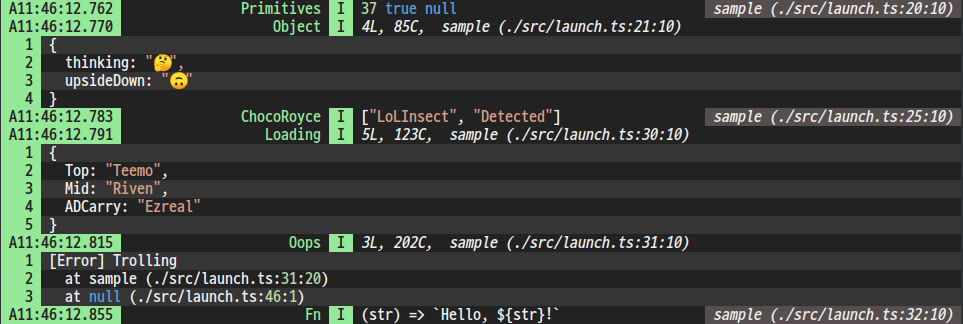
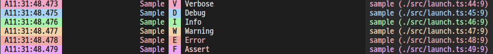
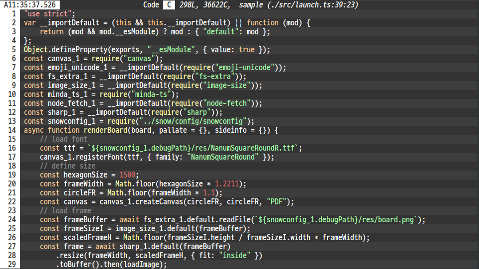

# Chocolog

## Usage
```typescript
import { cLog } from "chocolog"
// access directly
cLog.d("🤔")
// create instance with name
const log = cLog.getLogger("tsmap")
log.d("🤔")
```
Parameters length can be `1` or `2+`
```typescript
// content with default header(name)
cLog.d("🤔")
// content with custom header (first param)
cLog.d("thinking face", "🤔")
// multiple content (joining all) params with custom header
cLog.d("faces", "🤔", "🙃", "😗")
```


Parameters type can be anything (but recommend *Serializable*)
```typescript
// primitive type
cLog.i("Primitives", 37, " ", true, " ", null)
// simple object
cLog.i("Object", {
    thinking: "🤔",
    upsideDown: "🙃",
})
// array
cLog.i(["LoLInsect", "Detected"])
// map
const mp = new Map<string, string>()
mp.set("Top", "Teemo")
mp.set("Mid", "Riven")
mp.set("ADCarry", "Ezreal")
cLog.i("Loading", mp)
// Error
cLog.i("Oops", new Error("Trolling"))
// Function.. (not correctly)
cLog.i("Fn", (str:string) => `Hello, ${str}!`)
```

## Logging API
### `cLog.v(title[, ...desc])`
* *Verbose* (336 Hue)
* loglevel `1`
* Header `V`

### `cLog.d(title[, ...desc])`
* *Debug* (206 Hue)
* loglevel `2`
* Header `D`

### `cLog.i(title[, ...desc])`
* *Info* (122 Hue)
* loglevel `3`
* Header `I`

### `cLog.w(title[, ...desc])`
* *Warning* (35 Hue)
* loglevel `4`
* Header `W`

### `cLog.e(title[, ...desc])`
* *Error* (4 Hue)
* loglevel `5`
* Header `E`
* Contents will be colored to red

### `cLog.wtf(title[, ...desc])`
* *Assert* (294 Hue)
* loglevel `6`
* Header `F`


### `cLog.code(code[, title])`
* @type `code` string
* @type `title` string | number | boolean
* loglevel `1`
* Header `C`

Prints code using emphasize(highlight.js)



## Call Origin (Experimental)
Due to some limitation to parse call origin, default is disabled to use call origin.
Call origin can be enabled by passing `CLOG_ORIGIN` enviroment.

This modifies **stacktrace** much deeper globally!
I haven't found the way detecting caller
without extended stacktrace.
```json
// launch.json
"env": {
    ...
    "CLOG_ORIGIN": "true"
}
```

And for typescript, It uses external sourcemap file
to get infomation of `.ts`,
so needs to export sourceMap as `.map` file.
```json
// tsconfig.json
{
    ...
    "sourceMap": true
}
```
